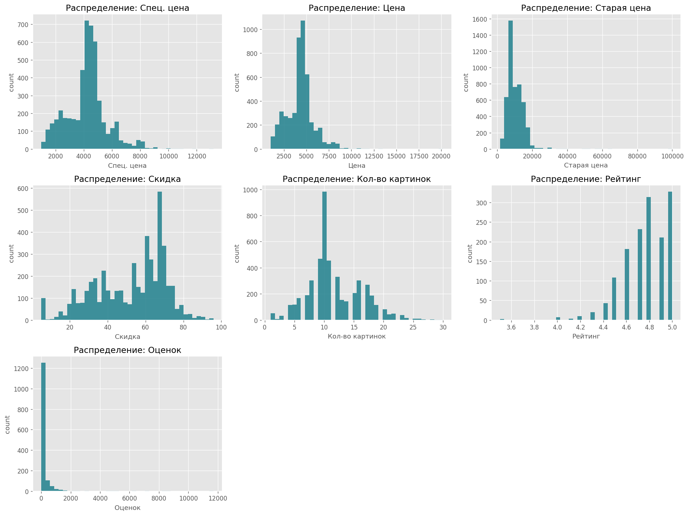
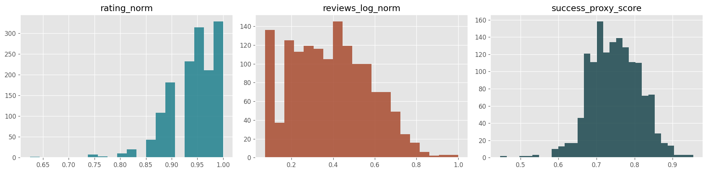
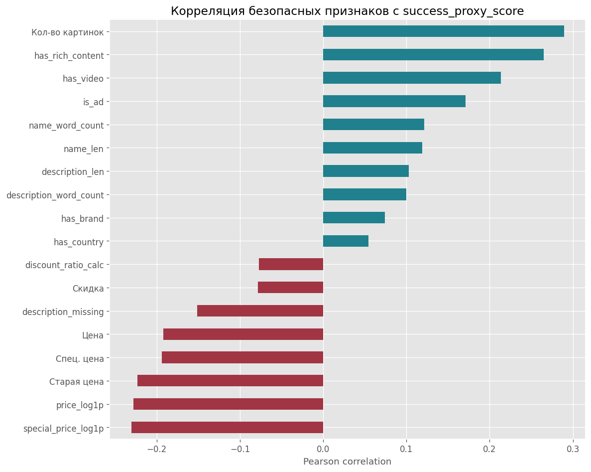
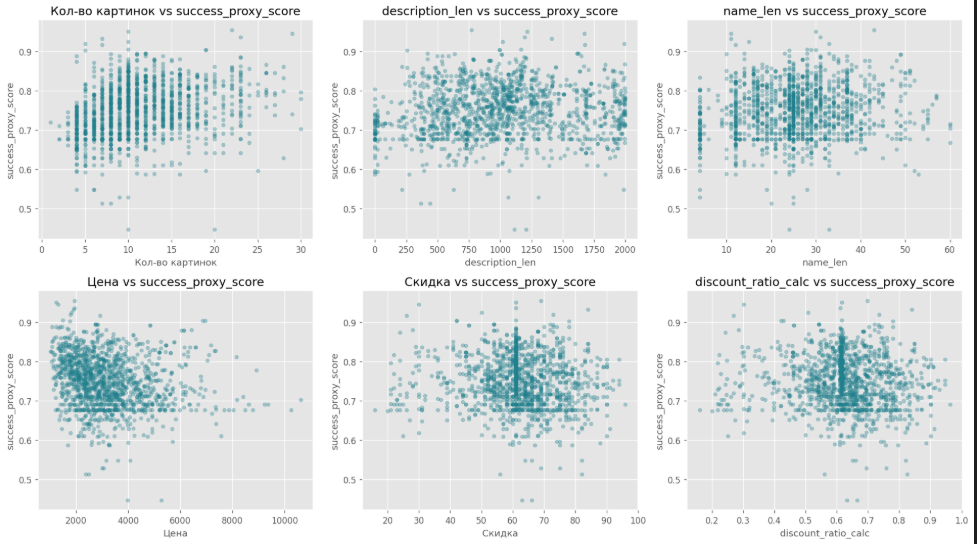
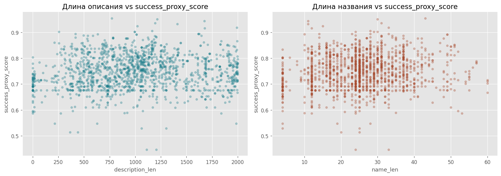
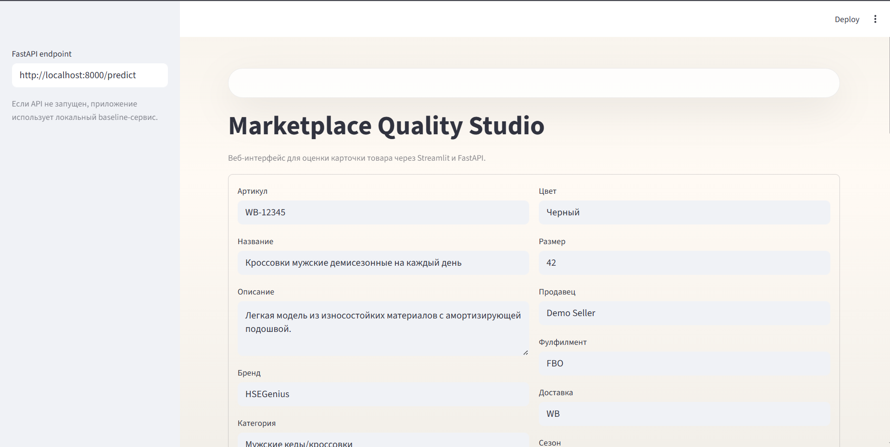
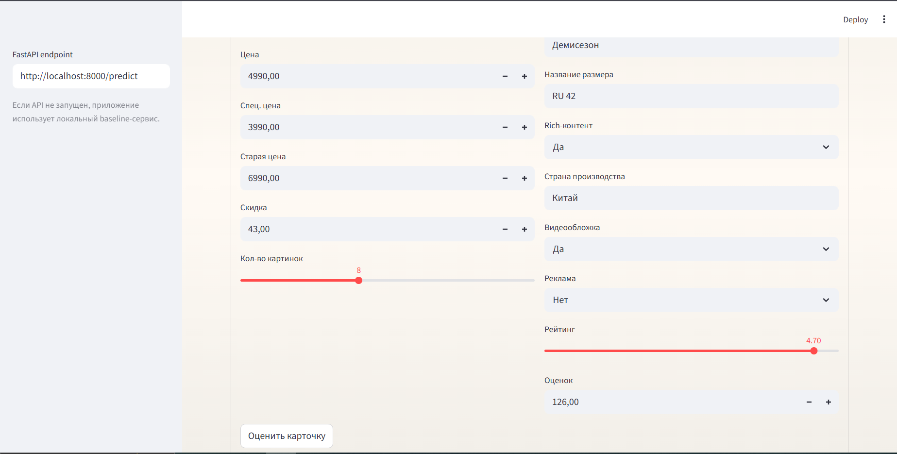
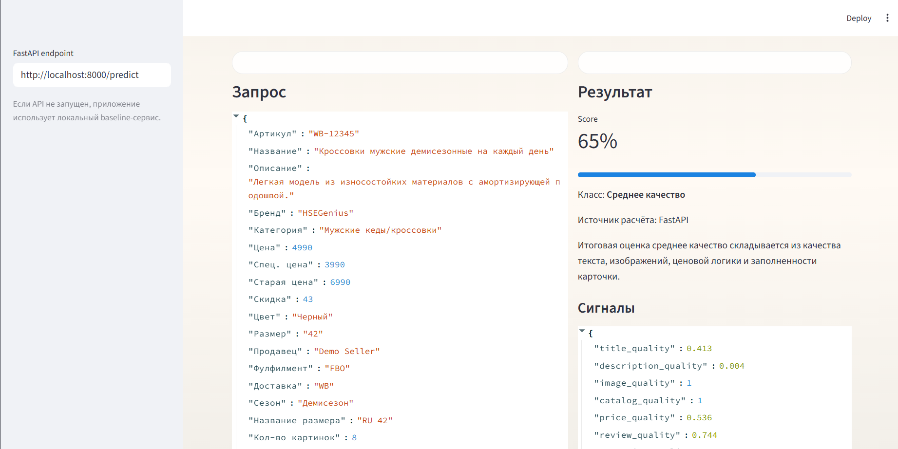
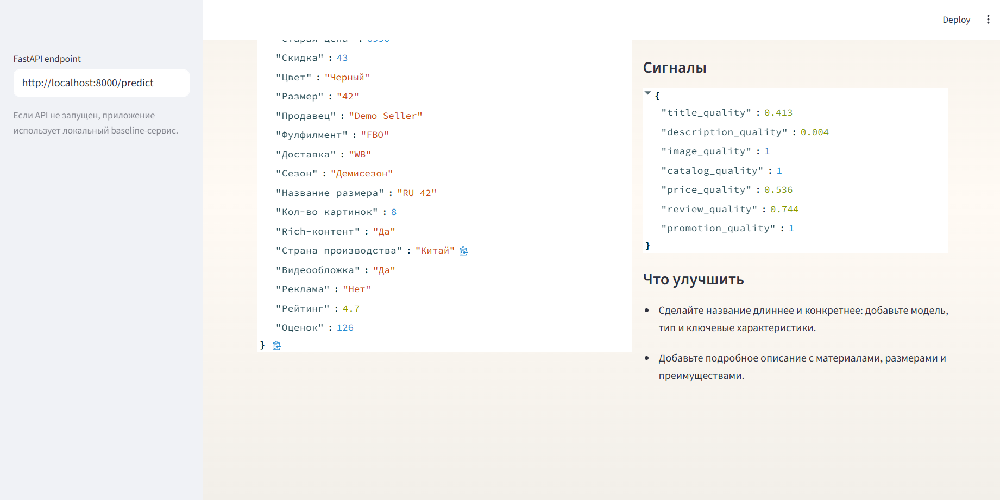

# Отчёт по проекту

**Студент:** Яшин Даниил Андреевич

**Группа:** БИВ232

---

## 1. Введение и постановка задачи

- **Цель проекта:** оценка успешности карточки товара на маркетплейсе
- **Формулировка задачи:** регрессия
- **Обоснование метрики качества:** выбрана метрика MAE, т.к. наш таргет нормализован в диапазоне от 0 до 1, также эта метрика устойчива к выбросам (на маркетплейсах часто встречаются суперпопулярные карточки товаров по сравнению с другими), также природа таргета скорее линейна, т.к. допустим оценка между карточками с показателем успеха 0.3 и 0.4 равнозначна для карточек с 0.8 и 0.9.

---

## 2. Поиск и описание данных

- **Источник данных:** использовано браузерное расширение MakretNinja для парсинга Wildberries в категории "Мужские кеды/кроссовки".
- **Описание датасета:**
  - **Объём:** исходный датасет содержит 4861 строку и 41 столбец.
  - **Описание признаков:** 
    - **Идентификаторы:** `Артикул`, `URL`.
    - **Признаки карточки:** `Бренд`, `Название`, `Цвет`, `Размер`, `Сезон`, `Описание`, `Состав`, `Страна производства`.
    - **Цена и скидки:** `Спец. цена`, `Цена`, `Старая цена`, `Скидка`.
    - **Визуальное оформление:** `Кол-во картинок`, `Видеообложка`, `Rich-контент`.
    - **Прокси-метрики для таргета:** `Рейтинг`, `Оценок`.
  - После очистки и удаления карточек без `Рейтинг` и/или `Оценок` в финальном датасете для моделирования осталось **1454** карточки. Для нашей задачи этого достаточно с некоторыми ограничениями: т.к. датасет собрани из узкого сегмента и покрывает преимущественно товары из верхних позиций выдачи.

---

## 3. Обработка и подготовка данных

- **Полная очистка:**
  - Отсутствующие видео-обложки закодированы `0`. В признаках для обучения применялся `SimpleImputer`: для числовых пропуски заполнялись медианой (в Pipeline), для категориальных - константным значением `__MISSING__`.
  - Удалена пустая колонка `Оплата за отзыв`. Полностью исключены карточки без `Рейтинг` и `Оценок`.
  - Формула таргета `success_proxy_score = 0.65 * rating_norm + 0.35 * reviews_log_norm`, где оценки логарифмировались (`log1p`), чтобы сгладить влияние суперпопулярных товаров с огромным числом отзывов.
- **Работа с фичами:**
  - Созданы новые фичи, отражающие полноту карточки: `name_len` (длина названия), `name_word_count`, `description_len`, `description_word_count`, бинарные `has_brand`, `has_country`, `has_video`, `has_rich_content`.
  - Также для цен использовал логарифмирование: `price_log1p`, `special_price_log1p`, `discount_ratio_calc`.
- **Визуализации:** 

- **Сплит данных:** 
  - Данные разбиты в пропорции 70% (train) / 15% (validation) / 15% (test).
  - Для равномерного распределения таргет-метрики стратификация проводилась через временные квантили (`pd.qcut` на 5 бинов).
  - **Data Leakage:** колонки `Рейтинг`, `Оценок` и любые их производные были исключены из обучающей выборки.

---

## 4. Baseline-модель

- **Модель:** В качестве baseline для оценки валидности признаков были выбраны `Ridge`, `LinearRegression`, `KNN`, `RandomForest`.
- **Цель:** Использовать модели без подбора гиперпараметров для определения точки отсчёта.
- **Результаты:** Базовая реализация `RandomForest` сразу показала хороший результат, по её метрикам будут оцениваться более сложные модели.

---

## 5. Эксперименты

- **Модели:** `RandomForest`, `XGBoost`, `LightGBM` (в т.ч. с тюнингом). 
- **PCA (90% дисперсии):** по кумулятивной дисперсии PCA для сохранения **90%** требуется **22** компоненты. В связке `RandomForest + PCA` обучение ускоряется, но качество ухудшается.
- Optuna для LightGBM показала следующий результат: `TPESampler(seed=42)`, поиск по `n_estimators∈[50,300]`, `learning_rate∈[1e-3,0.5] (log)`, `max_depth∈[3,12]`. Лучшие параметры: `n_estimators=64`, `learning_rate=0.21766`, `max_depth=9`.

| Модель | Гипотеза | Параметры | MAE | RMSE | Комментарий |
|--------|----------|-----------|------:|-------:|-------------|
| LightGBM_Tuned | Тюнинг поднимет качество бустинга | Optuna best: `n_estimators=64`, `learning_rate=0.21766`, `max_depth=9` (20 trials) | 0.03677 | 0.04935 | Лучшая по MAE; R2=0.42275, Spearman=0.67304 |
| XGBoost | Бустинг обгонит RandomForest без тюнинга | `n_estimators=100`, `max_depth=6` | 0.03723 | 0.05089 | Сильная модель без тюнинга; R2=0.38619, Spearman=0.64567 |
| LightGBM | LGBM без тюнинга будет сравним с XGBoost | `n_estimators=100` (остальное по умолчанию) | 0.03739 | 0.04960 | Близко к XGBoost; R2=0.41673, Spearman=0.66545 |
| RandomForest + PCA | PCA ускорит обучение при умеренной потере качества | PCA: `n_components=22` (90% дисперсии) + RF: `n_estimators=100`, `max_depth=10` | 0.03934 | 0.05159 | Быстрее, но MAE хуже; R2=0.36920, Spearman=0.65956 |

---

## 6. Финальная модель и интерпретируемость

- **Обоснование выбора финальной модели:** По результатам экспериментов наилучшую оценку качества показала модель `LightGBM` (с тюнингом через Optuna) - у неё минимальный MAE на валидационной выборке. Модель была также обучена на `train + validation` и проверена на `test`. Метрика на `test` оказалась стабильной, что доказывало отсутствие переобучения.
- **Интерпретируемость:** Деревья решений, лежащие в основе LightGBM, хорошо используют фичи, созданные во время EDA (такие как `Кол-во картинок`, наличие rich-контента, скидки и длины описаний). Чем детальнее и полнее карточка, тем выше ее предсказание успешности.

---

## 7. Деплой

- **Интерфейс:** реализован веб-интерфейс на Streamlit. Пользователь заполняет форму с характеристиками карточки товара и получает итоговую оценку качества, интерпретацию результата и рекомендации по улучшению.
- **API:** реализован FastAPI-сервис для отправки запросов из интерфейса и для прямой интеграции с другими системами.
- **Эндпоинты:**
  - `GET /` — проверка, что сервис запущен.
  - `GET /health` — healthcheck для мониторинга и ручной проверки статуса.
  - `POST /predict` — одиночное предсказание по одной карточке товара.
  - `POST /batch_predict` — пакетная оценка списка карточек.
  - `GET /example` — пример корректного JSON-запроса и ответа.
- **Локальный запуск:**
  - `docker compose up --build` - поднимает Jupyter, FastAPI и Streamlit.
  - `uvicorn src.api:app --reload --host 0.0.0.0 --port 8000` — запуск только API.
  - `streamlit run src/streamlit_app.py` - запуск только интерфейса.
- **Скриншоты** 

- **Ссылка на видео** [Демо-ролик](https://disk.360.yandex.ru/i/aQr3hYdupJYS_w)

---

## 8. Заключение и выводы

- **Итоги:** Сформулирована метрика успешности карточки товара, а модель `LightGBM` научилась ее достоверно предсказывать, побеждая baseline по MAE. Ансамбли на деревьях решений доказали свою эффективность при работе с данными маркетплейсов.
- **Ограничения:** Линейные модели и метод PCA показали спад качества, т.к. датасет был разрежен из-за OneHotEncoder. Из датасета пришлось выбросить много скрытых полей (о продавцах), требующих платной подписки, а также карточки без отзывов.
- **Возможные улучшения:** 
    1. Использовать трансформеры/LLM для построения эмбеддингов текстов (названия, описания, состава) вместо простых счетчиков длины слов.
    2. Спарсить изображения товаров и подавать их в виде векторов.
    3. Дообучать модель на новых трендах по сезонам.
